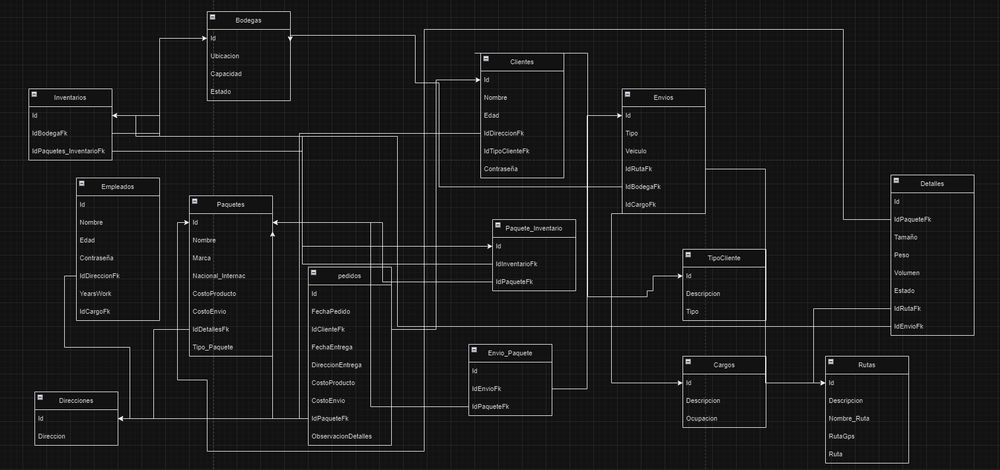

# Sistema de Gestión de Envíos - Backend

Este repositorio contiene el backend de la plataforma de gestión de envíos de Coordinadora, diseñado para permitir a los usuarios registrar, rastrear y administrar envíos de paquetes a nivel nacional e internacional.

## Contenido del Repositorio

1. **Diagrama Lógico de la Base de Datos:**
   - Se encuentra en el archivo `Logico.png`.
   - Representa las entidades y relaciones clave en el sistema.

2. **Diagrama Físico de la Base de Datos:**
   - Se encuentra en el archivo `Fisico.png`.
   - Muestra la estructura concreta de las tablas, campos y relaciones.

3. **Diagrama Relacional:**
   - Se encuentra en el archivo `Coordinadora.png`.
   - Proporciona una vista detallada de las relaciones entre las tablas de la base de datos.

## Base de Datos Normalizada

La base de datos ha sido normalizada hasta la Cuarta Forma Normal (4FN) para garantizar la eficiencia y la integridad de los datos.

## Instrucciones de Implementación

1. Clona este repositorio:

   ```bash
   git clone https://github.com/tuusuario/repo-envios-backend.git
   cd repo-envios-backend
   ```
## Diagrama Logico
   
## Diagrama Fisico
   
## Diagrama Relacional


